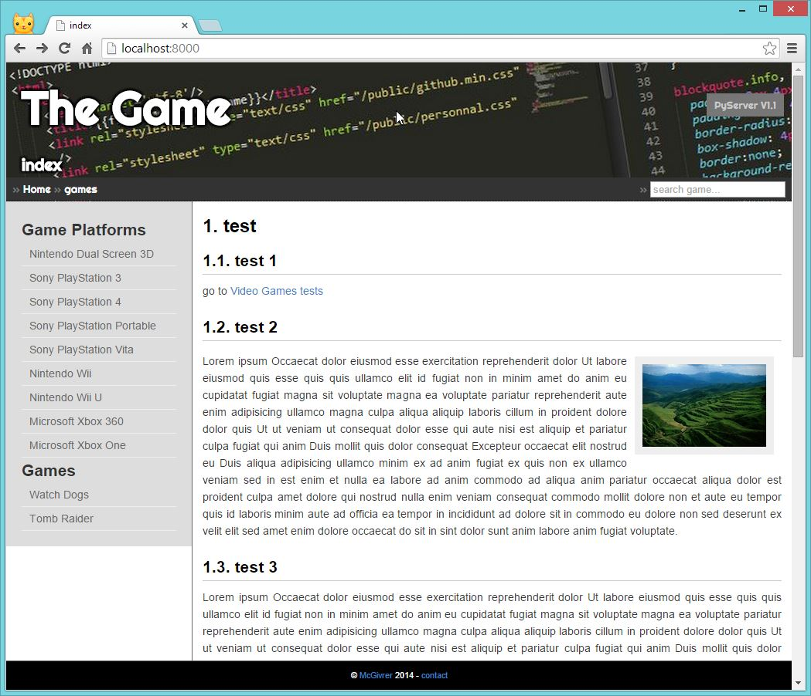
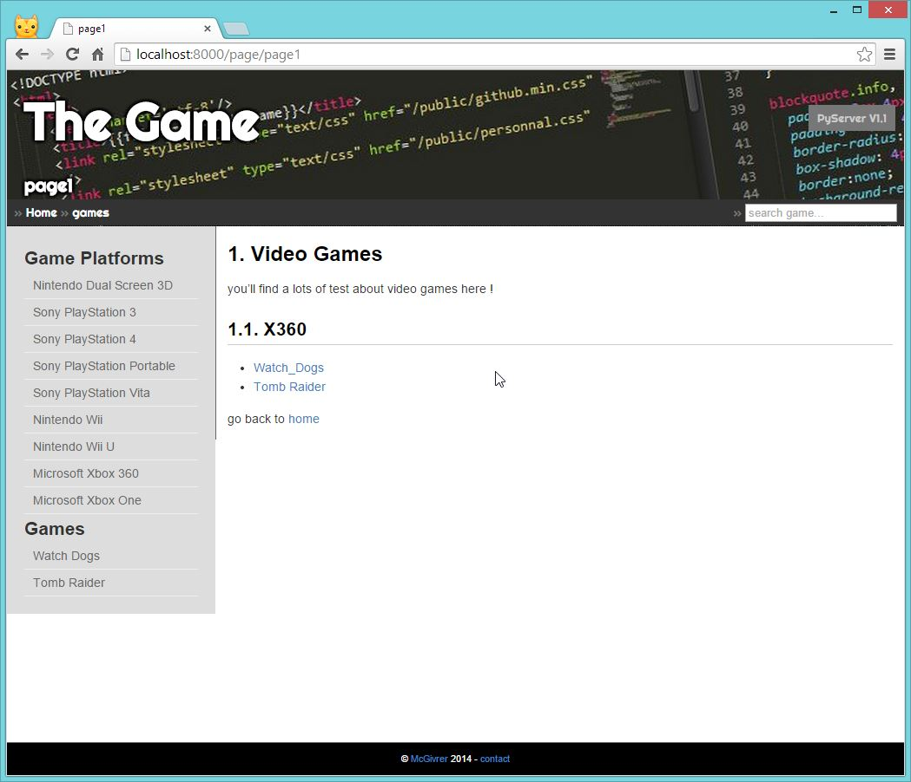
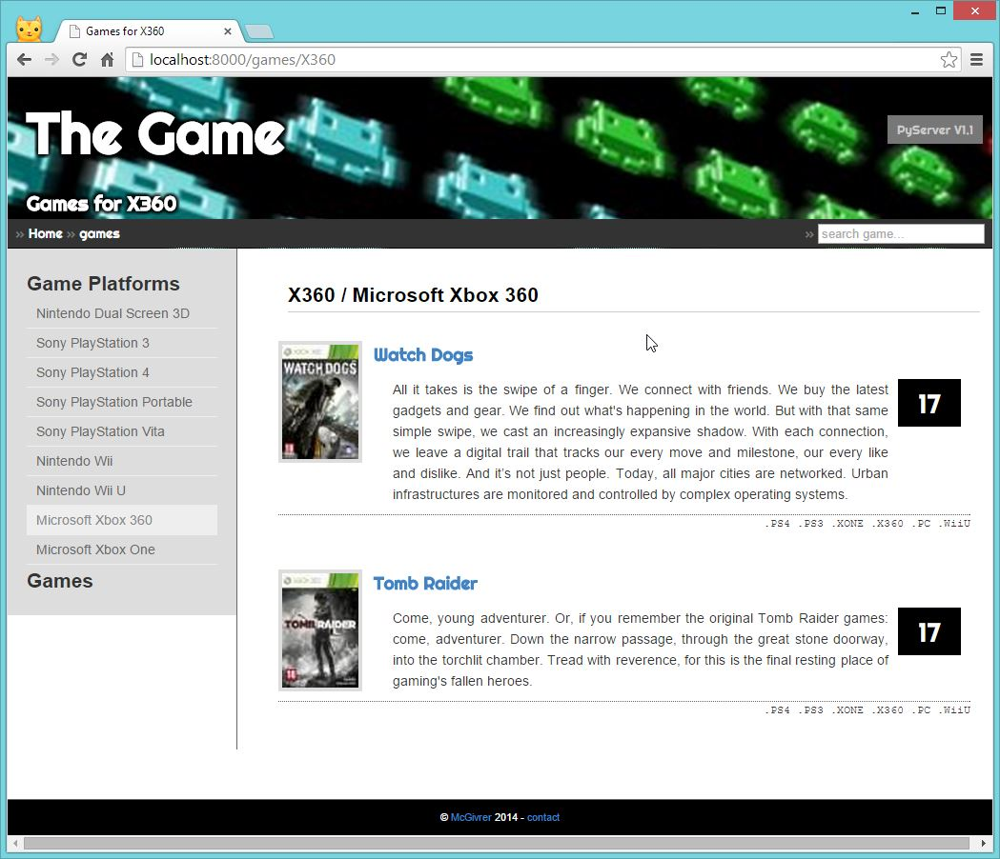
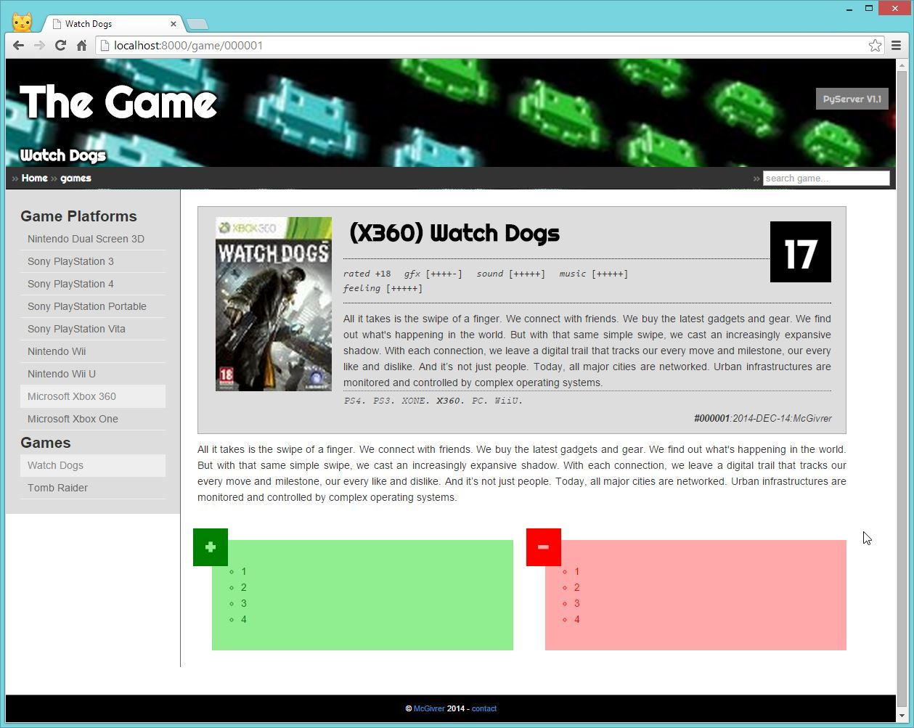
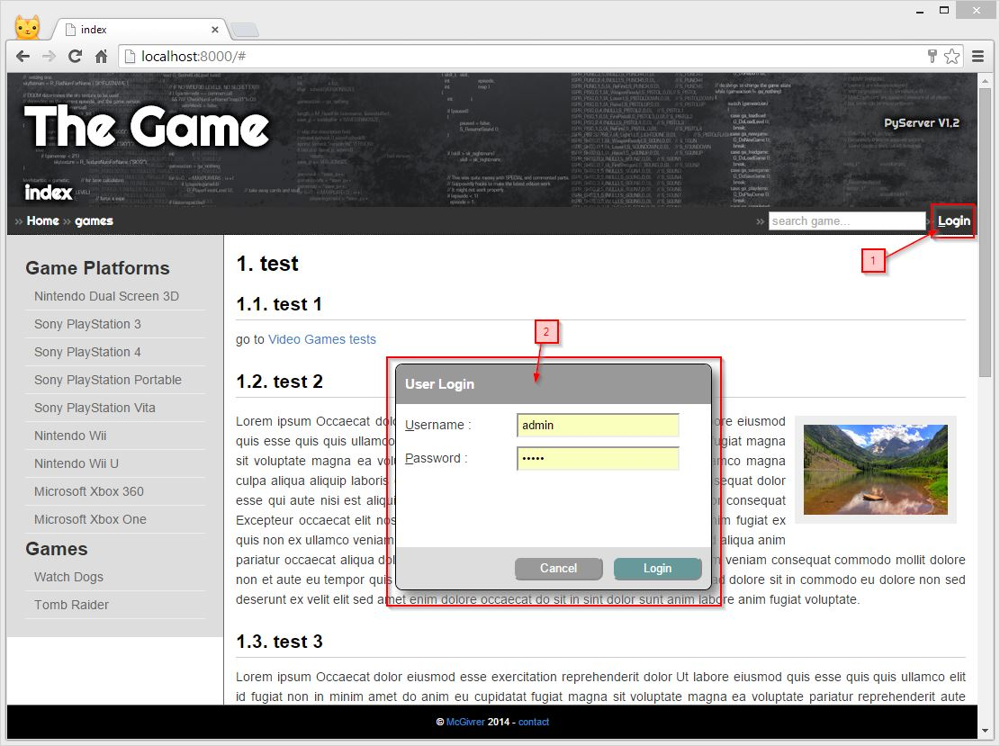

# PyTxServer v1.2

Created and updated on 14-DEC-2014 by [Frédéric Delorme](mailto:frederic.delorme@web-context.com)

## A smart and fast web server

Our new web server rely on the bottle framework and the cherrypy http multi-threading server. for the data side, you will need a mongodb server.
Data are initialized at startup.

to be able to start the server.py :

    :::bash
    $> pip install bottle
    $> pip install textile
    $> pip install cherrypy
    $> pip install pymongo
    
or

    :::bash
    $> pip install -r requirements.txt

And the, just run the server :

    :::bash
    $> python server.py

And go to [http://localhost:8000/](http://localhost:8000/)

### Textiles pages

It will serve you some textile pages from the pages path, and static files like css, images and javascript from the public path:

_(1). Pages are displayed accordingly to your textiles files and links_

_(2). Some links to other pages_

### Structured documents

And finally, its will be able to parse MongoDB collections to show structured data. Those collections could be initialized from json files in the data folder. In the delivered sample application, some Games "lorem ipsum" tests are displayed.

_(3). Games tests diplsayed by game platform_

_(4). One specific game test in details_

## Project folder structure

Please, see the following project structure :

    :::bash
    /pyserver
        |_ /dataset           # data for database initialization
        |    |_ games.json
        |    |_ platforms.json
        |    |_ users.json
        |_ /docs
        |    |_ images        # screenshots
        |_ /pages             # textiles pages for the website.
        |    |_ index.textile
        |    |_ page1.textile
        |_ /public            # styles, javascript and images
        |    |_ css
        |    |_ js
        |    |_ images
        |_ /views             # templates to render pages
        |    |_ main.tpl
        |    |_ page.tpl
        |    |_ game.tpl
        |    |_ games.tpl
        |_ databaseutils.py   # the data helpers over pymongo
        |_ htmlutils.py       # the html utilities
        |_ jsonutils.py       # the json loader
        |_ server.py          # the server
        |_ textutils.py       # the text specific tools
        |_ README.md          # this small file.
        |_ requirements.txt   # Dependencies descriptionfile for travis-ci.

## History

### 1.2 

Rewrite the README.md file to add screenshot, and start adding user login and user session support, thanks to the `beaker.middleware` and there `SessionMiddleware` component.

    :::python
    # Initialize session management.
    session_opts = {
        'session.type': 'file',
        'session.cookie_expires': 300,
        'session.data_dir': './sessions',
        'session.auto': True
    }
    app = SessionMiddleware(bottle.app(), session_opts)

then in the main code:

    :::bash
    def getUserFromSession():
        """
        Retrieve, if exist the user session. if not, return None.
        """
        session = bottle.request.environ.get('beaker.session')
        if('user' in session ):
            user = session['user']
        else:
            user = None
        return user

And add the needed form to log in a user :

_(5). The new login screen: 1. click, 2. Log username in._

### 1.1

Add some process about video game test and display.
see the **server.py#game(id)** method.

This version integrate a newnested template model to perform new rendering. Here is implemented the rendering for video game tests.

### 1.0

Here is a very simple server to test the [Bottle](http://bottlepy.org/) web server :)

Too easy to move to python and [bottle](http://bottlepy.org/), and [textile](https://pypi.python.org/pypi/textile) :)

## Bottle framework

Something very usefull: the [pdf](http://bottlepy.org/docs/dev/bottle-docs.pdf) docs !

## The Author

Frédéric Delorme is a Web developer and a software architect for many years and on multiple software platform. But he spent the 11 last years working professionally on the Java platform in the web world. Bulding WebApp solution for multiple customers, in many business activities, like Bank, Insurance, Industries, and web !

I've just joined in 2014, the GE Health Care team on a Dose management software solution.

see more @ [http://web-context.com](http://web-context.com).
